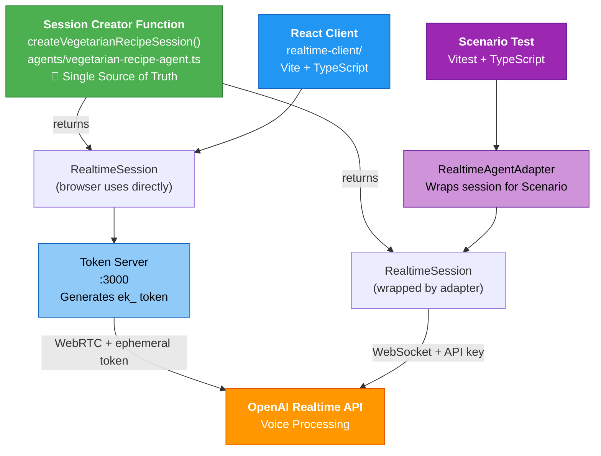

# Realtime Voice Agent

This example demonstrates how the browser and scenario framework interface with realtime sessions.

```mermaid
graph TB
    SessionCreator["`**Session Creator Function**
    createVegetarianRecipeSession()
    agents/vegetarian-recipe-agent.ts
    🎯 Single Source of Truth`"]

    Browser["`**React Client**
    realtime-client/
    Vite + TypeScript`"]

    Test["`**Scenario Test**
    Vitest + TypeScript`"]

    Session1["`RealtimeSession
    (browser uses directly)`"]

    TokenServer["`Token Server
    :3000
    Generates ek_ token`"]

    Adapter["`RealtimeAgentAdapter
    Wraps session for Scenario`"]

    Session2["`RealtimeSession
    (wrapped by adapter)`"]

    OpenAI["`**OpenAI Realtime API**
    Voice Processing`"]

    SessionCreator -->|returns| Session1
    SessionCreator -->|returns| Session2

    Browser --> Session1
    Session1 --> TokenServer
    TokenServer -->|WebRTC + ephemeral token| OpenAI

    Test --> Adapter
    Adapter --> Session2
    Session2 -->|WebSocket + API key| OpenAI

    style SessionCreator fill:#4CAF50,stroke:#2E7D32,color:#fff
    style Browser fill:#2196F3,stroke:#1565C0,color:#fff
    style Test fill:#9C27B0,stroke:#6A1B9A,color:#fff
    style OpenAI fill:#FF9800,stroke:#E65100,color:#fff
    style TokenServer fill:#90CAF9,stroke:#1565C0,color:#000
    style Adapter fill:#CE93D8,stroke:#6A1B9A,color:#000
```
